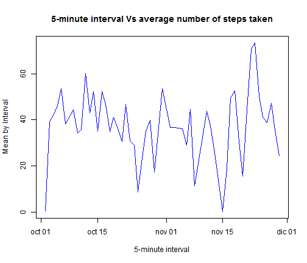

This is The Markdown to the first assignment in Reproducible Research
================================================================================

# Assignment Number 1 for Reproducible Research


```r
setwd("C:/Users/UER/Documents/GitHub/RepResearch_PeerAssignment1")
dev.off()
```

```
## null device 
##           1
```

this is going to work only if I have a device previously opened

## First Part

1. Load the data

2. Process/transform the data (if necessary) into a format suitable for your 


### Cleaning the data from na values

```r
# Reading data from file
data <- read.csv("activity.csv")
data$date <- as.Date(data$date, "%Y-%m-%d")
cleanData <- subset(data, steps != "NA")

```


## Second Part

What is mean total number of steps taken per day?

2. Calculate and report the mean and median total number of steps taken per day

```r
# getting the means
mean_by_date <- tapply(cleanData$steps, cleanData$date, mean)
total_steps_by_date <- tapply(cleanData$steps, cleanData$date, sum)
```


1. Make a histogram of the total number of steps taken each day

```r
# graph to find the histogram
hist(total_steps_by_date, col = "red", main = "Total Steps frecuency Histogram", 
    xlab = "")
```

 


```r
# getting the medians
median_by_date <- tapply(cleanData$steps, cleanData$date, median)
titles <- c("day", "mean", "median")
Report1 <- cbind(names(mean_by_date), as.vector(mean_by_date), as.vector(median_by_date))
colnames(Report1) <- titles
head(Report1)
```

```
##      day          mean               median
## [1,] "2012-10-02" "0.4375"           "0"   
## [2,] "2012-10-03" "39.4166666666667" "0"   
## [3,] "2012-10-04" "42.0694444444444" "0"   
## [4,] "2012-10-05" "46.1597222222222" "0"   
## [5,] "2012-10-06" "53.5416666666667" "0"   
## [6,] "2012-10-07" "38.2465277777778" "0"
```

```r
tail(Report1)
```

```
##       day          mean               median
## [48,] "2012-11-24" "50.2708333333333" "0"   
## [49,] "2012-11-25" "41.0902777777778" "0"   
## [50,] "2012-11-26" "38.7569444444444" "0"   
## [51,] "2012-11-27" "47.3819444444444" "0"   
## [52,] "2012-11-28" "35.3576388888889" "0"   
## [53,] "2012-11-29" "24.46875"         "0"
```

```r
Report1 <- as.data.frame(Report1)
Report1$day <- as.Date(Report1$day, "%Y-%m-%d")
Report1$mean <- mean_by_date
Report1$median <- median_by_date
# This is to show the table with the mean and median for day
Report1
```

```
##           day    mean median
## 1  2012-10-02  0.4375      0
## 2  2012-10-03 39.4167      0
## 3  2012-10-04 42.0694      0
## 4  2012-10-05 46.1597      0
## 5  2012-10-06 53.5417      0
## 6  2012-10-07 38.2465      0
## 7  2012-10-09 44.4826      0
## 8  2012-10-10 34.3750      0
## 9  2012-10-11 35.7778      0
## 10 2012-10-12 60.3542      0
## 11 2012-10-13 43.1458      0
## 12 2012-10-14 52.4236      0
## 13 2012-10-15 35.2049      0
## 14 2012-10-16 52.3750      0
## 15 2012-10-17 46.7083      0
## 16 2012-10-18 34.9167      0
## 17 2012-10-19 41.0729      0
## 18 2012-10-20 36.0938      0
## 19 2012-10-21 30.6285      0
## 20 2012-10-22 46.7361      0
## 21 2012-10-23 30.9653      0
## 22 2012-10-24 29.0104      0
## 23 2012-10-25  8.6528      0
## 24 2012-10-26 23.5347      0
## 25 2012-10-27 35.1354      0
## 26 2012-10-28 39.7847      0
## 27 2012-10-29 17.4236      0
## 28 2012-10-30 34.0938      0
## 29 2012-10-31 53.5208      0
## 30 2012-11-02 36.8056      0
## 31 2012-11-03 36.7049      0
## 32 2012-11-05 36.2465      0
## 33 2012-11-06 28.9375      0
## 34 2012-11-07 44.7326      0
## 35 2012-11-08 11.1771      0
## 36 2012-11-11 43.7778      0
## 37 2012-11-12 37.3785      0
## 38 2012-11-13 25.4722      0
## 39 2012-11-15  0.1424      0
## 40 2012-11-16 18.8924      0
## 41 2012-11-17 49.7882      0
## 42 2012-11-18 52.4653      0
## 43 2012-11-19 30.6979      0
## 44 2012-11-20 15.5278      0
## 45 2012-11-21 44.3993      0
## 46 2012-11-22 70.9271      0
## 47 2012-11-23 73.5903      0
## 48 2012-11-24 50.2708      0
## 49 2012-11-25 41.0903      0
## 50 2012-11-26 38.7569      0
## 51 2012-11-27 47.3819      0
## 52 2012-11-28 35.3576      0
## 53 2012-11-29 24.4688      0
```

## Third Part 

What is the average daily activity pattern?
1. Make a time series plot (i.e. type = "l") of the 5-minute interval (x-axis) and the average number of steps taken, averaged across all days (y-axis)

```r
mean_by_interval <- tapply(cleanData$steps, cleanData$date, mean)
```


```r
plot(as.Date(names(mean_by_interval)), as.vector(mean_by_interval), type = "l", 
    main = "5-minute interval Vs average number of steps taken", xlab = "5-minute interval", 
    ylab = "Mean by Interval", col = 4)
```

 

2. Which 5-minute interval, on average across all the days in the dataset, contains the maximum number of steps?

```r
names(which(mean_by_interval == max(mean_by_interval)))
```

```
## [1] "2012-11-23"
```


## Fourth Part

Imputing missing values
Note that there are a number of days/intervals where there are missing values (coded as NA). The presence of missing days may introduce bias into some calculations or summaries of the data.

1. Calculate and report the total number of missing values in the dataset (i.e. the total number of rows with NAs)

```r
sum(is.na(data$steps))
```

```
## [1] 2304
```

2. Devise a strategy for filling in all of the missing values in the dataset. The strategy does not need to be sophisticated. For example, you could use the mean/median for that day, or the mean for that 5-minute interval, etc.


```r
# Create a new dataset that is equal to the original dataset but with the
# missing data filled in.
naIndices <- which(is.na(data$steps))
# Copying the original dataset
dataCopy <- data
naIntervalsTreated <- dataCopy$interval[naIndices]
dataCopy$steps <- ifelse(is.na(dataCopy$steps), mean_by_interval[naIntervalsTreated], 
    dataCopy$steps)  # I'm generating a copy with the NA's filled
dataCopy$steps[naIndices] <- mean_by_interval
```

```
## Warning: número de items para para sustituir no es un múltiplo de la
## longitud del reemplazo
```

```r
filledMedianDate <- tapply(dataCopy$steps, dataCopy$date, median)
filledMeanInterval <- tapply(dataCopy$steps, dataCopy$date, mean)
```

Now, doing the graphics!

```r
# graph to find the histogram
hist(filledMeanInterval, col = "blue", main = "Means Histogram recalculated", 
    xlab = "Days")
```

 

Next Graphics:


```r
# 
par(mfcol = c(2, 2))
hist(total_steps_by_date, col = "red", main = "Total Steps histogram", xlab = "Days")
# graph to find the histogram
hist(filledMeanInterval, col = "cyan", main = "Filled Means Histogram", xlab = "Days")  # graph to find the histogram 
hist(median_by_date, main = "Original Median Histogram", xlab = "Days")  # graph to find the histogram 
hist(filledMedianDate, col = "blue", main = "Filled Median Histogram recalculated", 
    xlab = "Days")  # graph to find the histogram 
```

 


Create a new factor variable in the dataset with two levels - "weekday" and "weekend" indicating whether a given date is a weekday or weekend day.

```r
# This part is intented to distinguish between weekdays and weekends Please
# take Weekends as Saturdays and sundays
weekendVector <- weekdays(dataCopy$date)
weekendVector2 <- weekendVector
# regional coniguration language = Spanish
daysIndexes <- c(lunes = 1, martes = 2, miércoles = 3, jueves = 4, viernes = 5, 
    sábado = 6, domingo = 7)
weekendVector2 <- daysIndexes[weekendVector]
weekendVector3 <- as.factor(ifelse(weekendVector2 < 6, "weekday", "weekend"))
dataCopy_with_weekends <- cbind(dataCopy, weekendVector3)
# head(dataCopy_with_weekends) using subset function
newdata_weekdays <- subset(dataCopy, weekendVector3 == "weekday")
newdata_weekends <- subset(dataCopy, weekendVector3 == "weekend")
# graph to find the histogram
```

Now, Make a panel plot containing a time series plot (i.e. type = "l") of the 5-minute interval (x-axis) and the average number of steps taken, averaged across all weekday days or weekend days (y-axis). 


```r
# 
mean_steps_by_interval_weekdays <- tapply(newdata_weekdays$steps, newdata_weekdays$interval, 
    mean)
mean_steps_by_interval_weekends <- tapply(newdata_weekends$steps, newdata_weekends$interval, 
    mean)
# I have to remember that this is just a 2 pieces vector, date and mean
dev.off()  #Again, just to close the previous device
```

```
## null device 
##           1
```

```r
# 
```


```r
par(mfrow = c(2, 1))
plot(as.numeric(names(mean_steps_by_interval_weekdays)), mean_steps_by_interval_weekdays, 
    type = "l", col = 2, main = "Mean Steps by Interval", ylab = "weekday Steps", 
    xlab = "Interval")
plot(as.numeric(names(mean_steps_by_interval_weekends)), mean_steps_by_interval_weekends, 
    type = "l", col = 3, ylab = "weekend steps", xlab = "Interval")
```

 

###Ok, that's the end!


